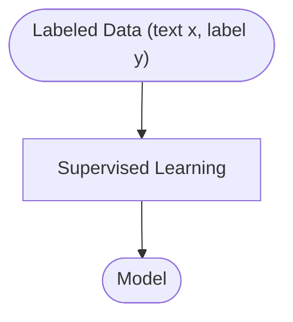
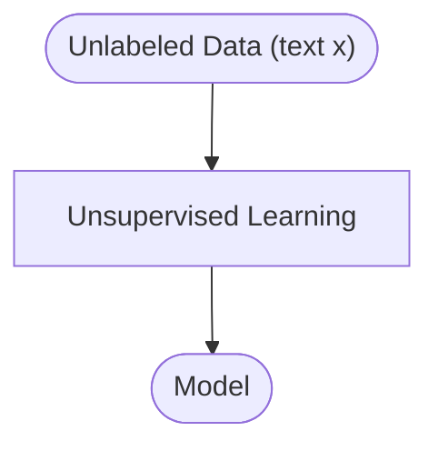
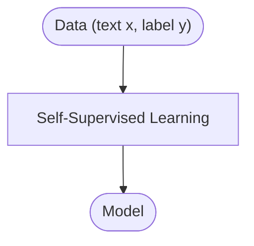

# Introduction to Natural Language Processing
## Natural Language Processing
> [!WARNING]
> The following series of notes assume basic programming skills (python) and mathematical skills (multivariable calculus and linear algebra).

> [!NOTE]
> Multiple sources and papers will be cited at the bottom of each page. Feel free to check them out and learn about the material for yourself :p

[Natural language processing (NLP)](https://en.wikipedia.org/wiki/Natural_language_processing) is an interdiciplinary subfield of [artificial intelligence](https://en.wikipedia.org/wiki/Artificial_intelligence) and [linguistics](https://en.wikipedia.org/wiki/Linguistics). Natural languages (or ordinary languages) are languages that have evolved naturally through human use. NLP primarily concerns the ability for computers to process information that is encoded into natural languages. 

### Some low level tasks of NLP include the following: 
+ tokenization
+ morphological analysis
+ syntactic analysis
+ semantic analysis
+ discourse analysis

### Some high level tasks of NLP include the following[^1]:
+ text classification/generation/summarization/simplification
+ sentiment analysis
+ information retrieval
+ machine translation
+ text-to-speech/text-to-image/text-to-video

## A Brief History of NLP
### Symbolic NLP (1950-1990)
In the 1950s, the field of NLP began to take shape with the introduction of rule-based systems, which aimed to facilitate machine translation through complex sets of specific linguistic rules. A notable early project was the Georgetown-IBM experiment in 1954, which successfully translated Russian sentences into English. These systems functioned by breaking down sentences into their grammatical components, matching each part to a set of rules, and then reconstructing the sentence in the target language. However, their inflexibility and inability to handle language nuances, idioms, or deeper contextual meanings, as well as a lack of scalability, became apparent, leading to a gradual shift towards statistical models in the 1980s and 1990s. This transition marked a significant evolution in NLP, moving from rigid, rule-based approaches to more adaptive, data-driven methods.

### Statistical NLP (1990-2010)
In the late 1980s, NLP experienced a major shift from rule-based systems to machine learning algorithms, driven by advances in computational power and a move away from traditional linguistic theories. This change enabled significant progress in the 1990s, particularly in machine translation, where statistical models like those developed by IBM capitalized on multilingual corpora from governmental texts. However, the success of these models was often limited by the availability of data. The 2000s brought a surge in raw language data from the web, leading to a focus on unsupervised and semi-supervised learning algorithms, which, despite being more complex and less accurate than supervised methods, benefited from the vast amounts of data available online.

### Neural NLP (2010-present)
In the early 2000s, neural networks began to revolutionize NLP, starting with Yoshua Bengio's 2003 work, where a multi-layer perceptron outperformed traditional word n-gram models in language modeling. This trend accelerated with Tomáš Mikolov's introduction of recurrent neural networks (RNNs) in 2010, leading to the development of Word2vec. The 2010s saw deep learning, especially through architectures like LSTMs and Transformers, become central to NLP, significantly improving tasks like language modeling and parsing. The introduction of the Transformer architecture in 2017 by Vaswani et al. marked a major leap forward, enabling models like BERT and GPT to excel in understanding and generating natural language by leveraging pre-training on vast corpora. Subsequent models, like XLNet, further enhanced the ability to capture contextual information, pushing the boundaries of language processing. 

### Important Papers
+ [Computing Machinery and Intelligence - A.M. Turing, 1950](https://courses.cs.umbc.edu/471/papers/turing.pdf)
+ [The Georgetown-IBM Experiment](https://open.unive.it/hitrade/books/HutchinsFirst.pdf)
+ [The Berkeley Restaurant Project - Daniel Jurafsky, 1994](https://web.stanford.edu/~jurafsky/icslp-red.pdf)
+ [Infini-gram: Scaling Unbounded n-gram Language Models to a Trillion Tokens - Jiacheng Liu, 2024](https://arxiv.org/pdf/2401.17377)
+ [A Neural Probabilistic Language Model - Yoshua Bengio, 2003](https://dl.acm.org/doi/pdf/10.5555/944919.944966)
+ [Recurrent neural network based language model - Tomáš Mikolov, 2010](https://gwern.net/doc/ai/nn/rnn/2010-mikolov.pdf)
+ [Attention Is All You Need - Ashish Vaswani, 2017](https://arxiv.org/pdf/1706.03762)

## Important Machine Learning Techniques
### Supervised Learning
Supervised learning is a machine learning approach where algorithms build a model based on a dataset containing both inputs and corresponding desired outputs, known as labels. The model iteratively optimizes its predictions by learning the relationship between input features and outputs through a process of minimizing error. For example, in NLP, a model might be trained for sentiment analysis to classify movie reviews as "positive" or "negative" based on labeled examples. Common supervised learning tasks include classification, where outputs are discrete categories, and regression, where outputs are continuous values. The effectiveness of supervised learning hinges on the quality and quantity of labeled data, which can be resource-intensive to obtain.

### Unsupervised Learning
In contrast to supervised learning, unsupervised learning is a machine learning approach that deals with datasets that have no labels. The primary goal of unsupervised learning is to uncover hidden patterns or structures within the data. For instance, clustering algorithms group data points into clusters based on their similarities, such as grouping customers based on purchasing behavior without predefined categories. Another common task is dimensionality reduction, where the algorithm simplifies the data by reducing the number of features while preserving essential information. Unsupervised learning is particularly useful for exploratory data analysis, though it can be challenging to interpret the results without clear labels.

### Self-Supervised Learning
Self-supervised learning is a machine learning approach where the system generates labels from the input data itself, allowing the model to learn without relying on external labels. This method leverages the structure of the data to create tasks where the "labels" are intrinsic parts of the input data. For instance, in NLP, a model might be trained to predict the next word in a sentence, where the context serves as the input and the next word is the self-generated label. A popular example is BERT (Bidirectional Encoder Representations from Transformers), where the model is trained to predict masked words in sentences. Self-supervised learning is valuable because it can utilize large amounts of unlabeled data, making it scalable and reducing the reliance on manually labeled datasets.

### Deep Learning
Deep learning is a subset of machine learning that involves training models with multiple layers of artificial neurons, which are inspired by the human brain's neural networks. These deep neural networks are capable of learning complex patterns and representations from data, making them highly effective for tasks such as image recognition, speech processing, and natural language understanding. A notable example of deep learning is the convolutional neural network (CNN), which excels in image classification tasks by learning hierarchical features from raw pixels. Deep learning models typically require large amounts of data and computational power for training, but their ability to learn from raw, unstructured data makes them extremely powerful for complex tasks that traditional machine learning models struggle with.

## The Mathematics Behind NLP

For more information:
[^1]: https://medium.com/nlplanet/two-minutes-nlp-33-important-nlp-tasks-explained-31e2caad2b1b